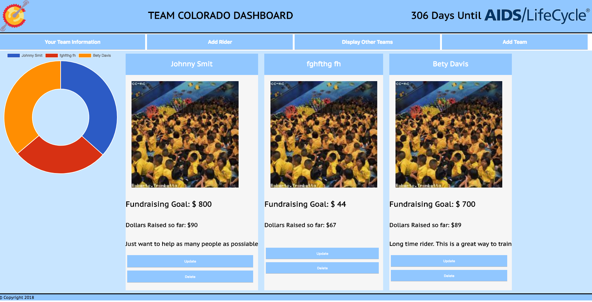

# Team Colorado Tracking Dashboard

This is a web app that allows the team captin to keep track of the team members and also track progress of other teams

## Getting Started

These instructions will get you a copy of the project up and running on your local machine for development and testing purposes. See deployment for notes on how to deploy the project on a live system.

### Prerequisites
```
You will need Node installed as well as Cypress to run the tests
```

### Installing


Clone the repo 

```
$ git clone https://github.com/Mike82co/project3.git
```

Move to the directory and run npm install

```
$ npm install
```

End with an example of getting some data out of the system or using it for a little demo

##Basic Navagation




## Running the tests

Cypress is used for the end to end testing. The tests are located in the cypress folder under integrations folder

### Break down into end to end tests

These are basic UI tests

```javascript

This exapmle makes sure the proper page loads

it('Should display a new rider form', () => {
	cy.get('#headerNav > button:nth-child(2)')
	.click()
	cy.get('#root > div > div.mainContent > div')
	.should('contain', 'New Rider Information Form')
})

```


## Built With

* [React](https://reactjs.org/) - The web framework used
* [Cypress](https://www.cypress.io/) - Testing


## Authors
 **Mike Lavin**

## Deployed Link
https://p3tower.firebaseapp.com/ . client
https://project3db.herokuapp.com . server
